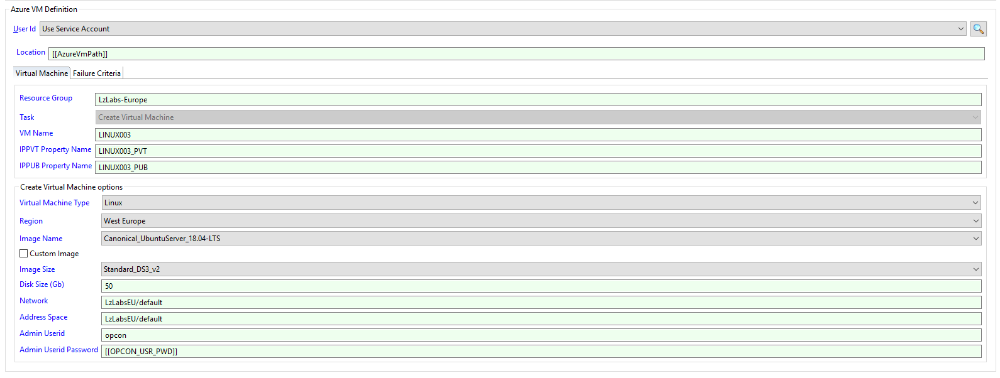

# Enterprise Manager sub-type operation

**Theme:** Configure | **Audience:** Automation Engineer

## What is it?

The Enterprise Manager sub-type provides a Windows job sub-type form for defining Azure VM jobs within OpCon's Enterprise Manager interface. It simplifies the process of building the command-line arguments required to run each connector task.

- Use this sub-type when your OpCon environment uses Enterprise Manager and you want a guided form for defining Azure VM job definitions.
- Use this sub-type when you need to manage Azure virtual machines — create, delete, start, stop, restart, or list — as automated steps in an OpCon schedule.

## Prerequisites

Before defining Azure VM jobs, confirm the following:

- The Azure VM Connector is installed on a Windows agent. See [Installation](./installation.md).
- The `AzureVmPath` global property is created and contains the connector installation directory.
- The global properties `AZURE_WINDOWS_SERVERS`, `AZURE_LINUX_SERVERS`, and `AZURE_SERVER_SIZES` are created and populated with valid values. These properties populate the drop-down lists in the sub-type form.

The three global properties are defined as follows:

| Property | Description |
|---|---|
| `AZURE_WINDOWS_SERVERS` | Comma-separated list of Windows VM image names (double quotes required around each value) |
| `AZURE_LINUX_SERVERS` | Comma-separated list of Linux VM image names (double quotes required around each value) |
| `AZURE_SERVER_SIZES` | Comma-separated list of VM size names (double quotes required around each value) |

## AzureVM job sub-type

The AzureVM connector provides a Windows job sub-type that simplifies job definitions in OpCon.

To define an Azure VM job in Enterprise Manager, complete the following steps:

1. Create or open a Windows job in Enterprise Manager.
2. From the **Job Sub-Type** list, select **Azure VM**.
3. From the **Task** list, select the task to perform.
4. Enter the required field values for the selected task. Only fields applicable to the selected task are enabled.
5. Select **Save**.



:::note
Once a task has been saved, the task type cannot be changed.
:::

When creating a virtual machine, complete the following fields:

1. From the **Virtual Machine Type** list, select **Windows** or **Linux**. The **Image Name** list updates to show images for the selected type.
2. From the **Region** list, select the target Azure region.
3. From the **Image Name** list, select the image to use. To use a custom image, select the **Custom Image** checkbox. When using a custom image, a disk size is not required.
4. From the **Image Size** list, select the VM size. For custom images, the size must match the size used when the image was created.
5. In the **Disk Size (Gb)** field, enter a disk size in gigabytes. This field is required for non-custom images.
6. In the **Network** and **Address Space** fields, enter the virtual network and subnet. To add the VM to an existing network, enter the existing network name.
7. In the **Admin Userid** field, enter an administrator user name following the naming requirements for your VM type.
8. In the **Admin Userid Password** field, enter the administrator password. Encrypted global properties can be used to conceal the password value.

## AzureVM arguments

The AzureVM connector uses command-line arguments to define tasks. The sub-type form generates these arguments automatically when a job is saved.

### Global arguments

The following arguments apply to all tasks:

| Argument | Description |
|---|---|
| `-rg` | (Required) The resource group associated with the Azure request |
| `-t` | (Required) The task to perform |

### Create virtual machine

Creates a new virtual machine in the associated resource group.

| Argument | Description |
|---|---|
| `-t` | Value: `create` |
| `-vm` | (Required) The name of the virtual machine to create |
| `-ippvt` | (Optional) The global property name to store the private IP address of the new VM |
| `-ippub` | (Optional) The global property name to store the public IP address of the new VM |
| `-r` | (Required) The Azure region where the VM will be created |
| `-at` | (Required) The attributes used to create the VM |
| `-ci` | (Optional) Include this flag if the image is a custom image |

Example:

```
AzureVM.exe -rg MY_RESOURCEGROUP -t create -vm MY_VMACHINE -ippvt MY_VMACHINE_PVT -ippub MY_VMACHINE_PUB -at "linux,LINUX003,Canonical_UbuntuServer_18.04-LTS,Standard_DS3_v2,50,myadmin,<SmaEncrypt>Ohj+VFLoM3YX0WxNNN4vJQ==</SmaEncrypt>,LzLabsEU/default,LzLabsEU/default,"
```

### Delete virtual machine

Removes a virtual machine from the resource group.

| Argument | Description |
|---|---|
| `-t` | Value: `delete` |
| `-vm` | (Required) The name of the virtual machine to delete |

Example:

```
AzureVM.exe -rg MY_RESOURCEGROUP -t delete -vm MY_VMACHINE
```

### List virtual machines

Returns status information for all virtual machines in the resource group.

| Argument | Description |
|---|---|
| `-t` | Value: `list` |

Example:

```
AzureVM.exe -rg MY_RESOURCEGROUP -t list
```

Sample output:

```
------------------------------------------------------------------------------------------------------------------ 
Virtual Machine Name     Region              Current State                 IP Private     IP Public      OS Type    
------------------------------------------------------------------------------------------------------------------ 
LINUX001                 West Europe         PowerState/running            10.1.0.17      52.178.65.0    LINUX      
LINUX002                 West Europe         PowerState/running            10.1.0.16      13.95.134.20   LINUX      
LINUX003                 West Europe         PowerState/running            10.1.0.18      13.95.106.31   LINUX      
OpCon                    West Europe         PowerState/running            10.1.0.6       52.166.248.28  WINDOWS    
SDM2                     West Europe         PowerState/stopped            10.1.0.9       168.63.108.63  LINUX      
------------------------------------------------------------------------------------------------------------------ 
```

### PowerOff virtual machine

Powers off a virtual machine. The VM is stopped but resources remain allocated.

| Argument | Description |
|---|---|
| `-t` | Value: `poweroff` |
| `-vm` | (Required) The name of the virtual machine to power off |

Example:

```
AzureVM.exe -rg MY_RESOURCEGROUP -t poweroff -vm MY_VMACHINE
```

### Restart virtual machine

Restarts a virtual machine. Optionally stores the IP addresses after restart.

| Argument | Description |
|---|---|
| `-t` | Value: `restart` |
| `-vm` | (Required) The name of the virtual machine to restart |
| `-ippvt` | (Optional) The global property name to store the private IP address after restart |
| `-ippub` | (Optional) The global property name to store the public IP address after restart |

Example:

```
AzureVM.exe -rg MY_RESOURCEGROUP -t restart -vm MY_VMACHINE -ippvt MY_VMACHINE_PVT -ippub MY_VMACHINE_PUB
```

### Start virtual machine

Starts a stopped virtual machine. Optionally stores the IP addresses after startup.

| Argument | Description |
|---|---|
| `-t` | Value: `start` |
| `-vm` | (Required) The name of the virtual machine to start |
| `-ippvt` | (Optional) The global property name to store the private IP address after startup |
| `-ippub` | (Optional) The global property name to store the public IP address after startup |

Example:

```
AzureVM.exe -rg MY_RESOURCEGROUP -t start -vm MY_VMACHINE -ippvt MY_VMACHINE_PVT -ippub MY_VMACHINE_PUB
```

## Exit codes

The connector returns `0` on success and `1` on failure.

To detect a failure, set the **Failure Criteria** for the job to **NE** (Not Equal) to `0`.

## FAQs

**What is the difference between PowerOff and Delete?**
PowerOff stops the VM and keeps it in a stopped state while Azure continues to reserve the allocated resources. Delete removes the VM and its resources from the resource group entirely.

**Can I store the VM's IP address in an OpCon global property after a start or restart?**
Yes. Use the `-ippvt` argument to store the private IP address and `-ippub` to store the public IP address. Provide the name of the global property (not the property value) as the argument value.

**Can I use encrypted global properties for the Admin Userid Password?**
Yes. Encrypted global properties can be referenced in the **Admin Userid Password** field to avoid displaying the password in plaintext in the job definition.

**Why does saving a job lock the task type?**
The task type determines which fields are required and which arguments are generated. Changing the task type after saving would invalidate the saved field values.

## Glossary

**Resource group** — An Azure container that holds related resources such as virtual machines. All connector tasks target a single resource group per job.

**Sub-type** — A guided form in Enterprise Manager that simplifies job definition for a specific connector. The Azure VM sub-type generates the required command-line arguments for the selected task.

**Global property** — A named value stored in OpCon that can be referenced in job definitions. Used by the Azure VM Connector to provide image lists, size lists, and to store VM IP addresses after job completion.

**PowerState/running** — The Azure VM status indicator that confirms the VM is powered on and operational, as shown in the `list` task output.
