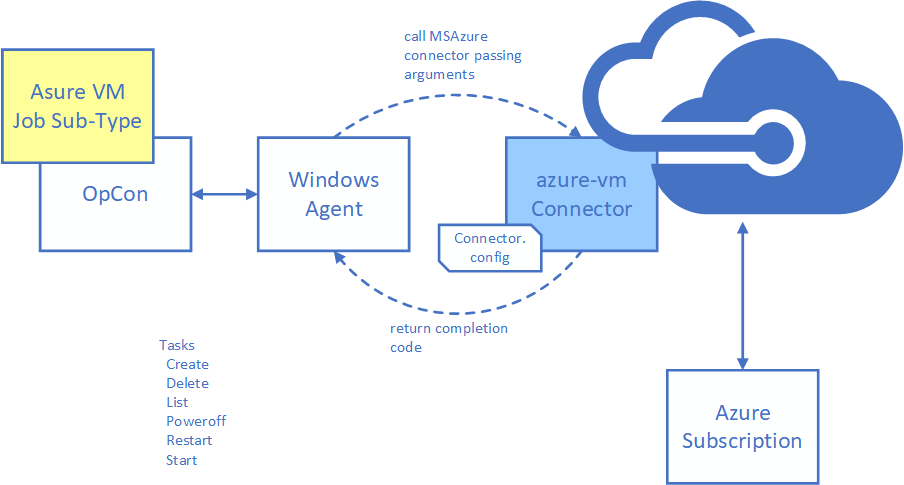

# Azure VM

Azure VM is an OpCon Connector for Windows that uses the Azure Java SDK to interact with Azure virtual machines. 
Provides tasks to manage virtual machines.

- **list**           Provides information on virtual machines in the resourge group (current status, region, ip-addresses & os type)     
- **create**         Create a virtual machine.
- **delete**         Delete a virtual machine.
- **poweroff**       Power off a virtual machine.
- **restart**        Restart a virtual machine.
- **start**          Start a virtual Machine.
