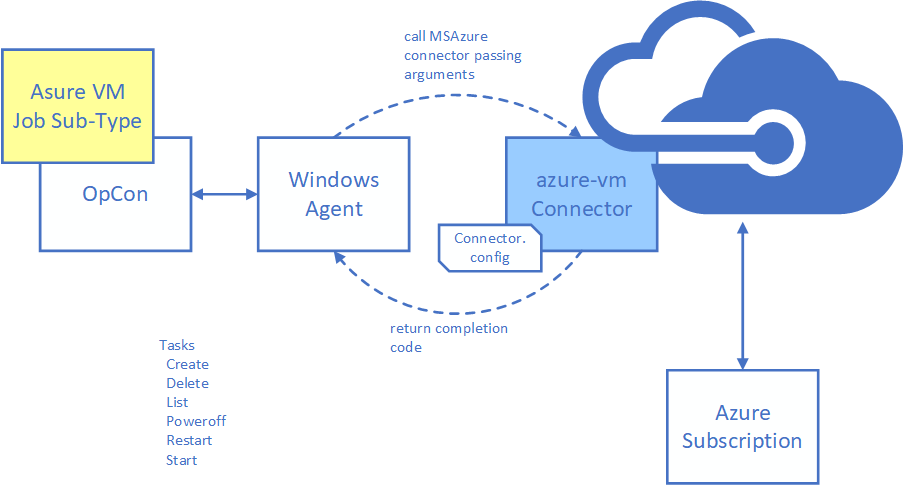

# Azure VM Connector overview

**Theme:** Overview | **Audience:** System Administrator, Automation Engineer

## What is it?

The Azure VM Connector is an OpCon connector for Windows that uses the Azure Java SDK to interact with Azure virtual machines. It enables OpCon to automate the full lifecycle of Azure VMs — from provisioning to shutdown — without manual intervention.

- Use this connector when you need to start, stop, restart, or provision Azure virtual machines as part of an automated OpCon workflow.
- Use this connector when you need to list and report on VM status across a resource group as part of a monitoring or operations schedule.
- Use this connector to integrate cloud VM management with on-premises job scheduling, ensuring VMs are running only when required.

## Supported tasks

The connector supports the following tasks against Azure virtual machines:

| Task | Description |
|---|---|
| **list** | Returns status, region, IP addresses, and OS type for all VMs in the resource group. |
| **create** | Creates a new virtual machine from a defined image. |
| **delete** | Removes a virtual machine from the resource group. |
| **poweroff** | Powers off a virtual machine (does not deallocate resources). |
| **restart** | Restarts a virtual machine. |
| **start** | Starts a stopped virtual machine. |

## Sub-type options

The connector supports two job sub-type options depending on which OpCon interface you use to define jobs.

### Enterprise Manager sub-type

Enterprise Manager provides a Windows job sub-type plug-in that simplifies creating the command-line arguments required to run connector tasks. The sub-type appears as **Azure VM** in the Windows job sub-type list.

Requires OpCon Release 19.0 or higher.

### Solution Manager sub-type

The ACS framework (available in OpCon 25.0.3 or higher) provides a Solution Manager-based sub-type for the Azure VM connector. It centralizes the `Connector.config` file within the OpCon environment and provides a wrapper around the connector executable.

The sub-type appears as an ACS Agent of type **AzureVM** in Solution Manager.

Requires OpCon Release 25.0.3 or higher.

## FAQs

**Which sub-type should I use?**
Use the Solution Manager sub-type if you are running OpCon 25.0.3 or higher and prefer managing configuration centrally within Solution Manager. Use the Enterprise Manager sub-type if you are running an older OpCon release or prefer to manage configuration files directly on the Windows agent.

**Can the connector be installed on any Windows server?**
When using the Enterprise Manager sub-type, the connector can be installed on any Windows server that has an OpCon Windows agent installed. When using the Solution Manager sub-type, the connector must be installed on the same Windows server as the OpCon installation or the Relay installation.

**Does the connector support custom VM images?**
Yes. When creating a virtual machine, you can select a custom image by checking the **Custom Image** option. When using a custom image, a disk size is not required, and the image size should match the size used when the custom image was created.

**What Java version does the connector use?**
The connector uses an embedded OpenJDK 11 distribution bundled in the `java` directory of the installation. No separate Java installation is required.

## Glossary

**ACS framework** — The Agent Configuration Service framework, available in OpCon 25.0.3 and later, that centralizes connector configuration within the OpCon environment and provides a wrapper for ACS-compatible connectors.

**Resource group** — An Azure container that holds related Azure resources, such as virtual machines, for a solution. The Azure VM Connector operates within a single resource group per job definition.

**Connector.config** — The configuration file used by the Azure VM Connector to store Azure account credentials (encrypted) and OpCon API connection settings.

**Sub-type** — A job definition template in OpCon that provides a guided form for entering the arguments required by a specific connector or integration. The Azure VM Connector provides sub-types for both Enterprise Manager and Solution Manager.
